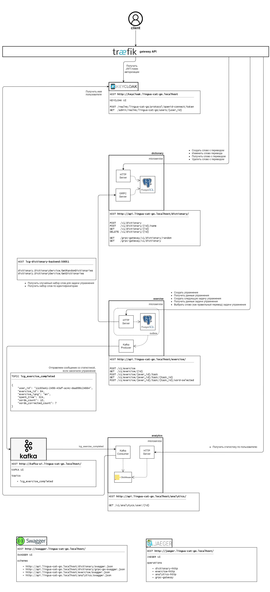

# Lingua-Cat-Go

**Lingua-Cat-Go** — это проект для обучения иностранным словам.
Система состоит из API Gateway (Traefik), сервиса аутентификации (Keycloak), трёх основных микросервисов (Dictionary, Exercise, Analytics), а также Kafka для асинхронной передачи событий и ClickHouse для аналитики.



---

## Структура репозитория

```

/backend
├── analytics                      # Сервис аналитики: потребляет события из Kafka и отдаёт статистику
│  ├── cmd
│  │  └── main.go                  # Точка входа: запуск HTTP-сервера и Kafka-консьюмера
│  ├── delivery                    # Внешний слой
│  │  ├── http
│  │  │  └── exercise_complete_handler.go  # HTTP-эндпоинты
│  │  └── kafka
│  │     └── exercise_complete_handler.go  # Kafka-обработчик
│  ├── docker-compose.yml          # Конфиг Docker для analytics
│  ├── docs
│  │  └── swagger.json             # OpenAPI-спецификация для HTTP analytics
│  ├── domain                      # Бизнес-модель
│  │  ├── errors.go                # Определение бизнес-ошибок
│  │  ├── exercise_complete.go     # Интерфейсы и сущность выполненного упражнения
│  │  ├── user.go                  # Интерфейсы и сущность пользователя
│  │  └── validator.go             # Кастомные валидаторы доменных структур
│  ├── internal                    # Внутренние пакеты
│  │  ├── config
│  │  │  └── config.go             # Конфигурация сервиса (из переменных окружения)
│  │  ├── validator
│  │  │  └── validator.go          # Интеграция кастомных валидаторов
│  │  └── wire
│  │     ├── wire.go               # DI-конфигурация с Google Wire
│  ├── migrations                  # SQL-миграции для ClickHouse
│  ├── repository                  # Реализация хранилищ
│  │  ├── clickhouse
│  │  │  └── exercise_complete.go  # Запись и чтение статистики по выполненным упражнениям
│  │  └── http
│  │     └── user.go               # Получение имени пользователя в сервисе аутентификации
│  └── usecase                     # Бизнес-логика
│     ├── exercise_complete_usecase.go  # Получение и сохранение статистики
│     ├── exercise_complete_usecase_test.go  # Тесты для exercise_complete-usecase
│     ├── user_usecase.go          # Получение имени пользователя
│     └── user_usecase_test.go     # Тесты для user-usecase
│
├── dictionary                     # Сервис словаря: Получение и сохранение слов и переводов
│  ├── cmd
│  │  └── main.go                  # Точка входа: запуск HTTP и gRPC серверов
│  ├── delivery                    # Внешний слой
│  │  ├── grpc
│  │  │  ├── dictionary_handler.go  # Обработка gRPC-запросов
│  │  │  └── gen                    # Сгенерированные proto-файлы
│  │  └── http
│  │     ├── dictionary_handler.go  # HTTP-эндпоинты
│  │     └── validator.go          # Кастомные валидаторы входных данных
│  ├── docker-compose.yml          # Конфиг Docker для dictionary
│  ├── docs
│  │  ├── grpc-gw-swagger.json     # OpenAPI-спецификация для gRPC-gateway analytics
│  │  └── swagger.json             # OpenAPI-спецификация для HTTP analytics
│  ├── domain                      # Бизнес-модель
│  │  ├── dictionary.go            # Интерфейсы и сущность слова
│  │  ├── errors.go                # Определение бизнес-ошибок
│  │  ├── sentence.go              # Сущность примеров предложений с переводимым словом
│  │  ├── translation.go           # Сущность перевода слова
│  │  └── validator.go             # Кастомные валидаторы доменных структур
│  ├── internal                    # Внутренние пакеты
│  │  ├── config
│  │  │  └── config.go             # Конфигурация сервиса (из переменных окружения)
│  │  ├── validator
│  │  │  └── validator.go          # Интеграция кастомных валидаторов
│  │  └── wire
│  │     ├── wire.go               # DI-конфигурация с Google Wire
│  ├── migrations                  # SQL-миграции для PostgreSQL
│  ├── repository                  # Реализация хранилищ
│  │  └── postgres
│  │     └── dictionary.go         # Запись и чтение слов с их переводами и предложениями
│  └── usecase                     # Бизнес-логика
│     ├── dictionary_usecase.go    # Получение и сохранение слов с их переводами и предложениями
│     └── dictionary_usecase_test.go  # Тесты для dictionary-usecase
│
├── exercise                       # Сервис упражнений: создание упражнений и прохождение заданий
│  ├── cmd
│  │  └── main.go                  # Точка входа: запуск HTTP-сервера и продюсера Kafka (Outbox)
│  ├── delivery                    # Внешний слой
│  │  └── http
│  │     ├── exercise_handler.go   # HTTP-эндпоинты для упражнений
│  │     └── task_handler.go       # HTTP-эндпоинты для заданий упражнения
│  ├── docker-compose.yml          # Конфиг Docker для exercise
│  ├── docs
│  │  └── swagger.json             # OpenAPI-спецификация для HTTP exercise
│  ├── domain                      # Бизнес-модель
│  │  ├── dictionary.go            # Интерфейсы и сущность слова
│  │  ├── errors.go                # Определение бизнес-ошибок
│  │  ├── exercise.go              # Интерфейсы и сущность упражнения
│  │  ├── sentence.go              # Сущность примеров предложений с переводимым словом
│  │  ├── task.go                  # Интерфейсы и сущность задания упражнения
│  │  ├── translation.go           # Сущность перевода слова
│  │  └── validator.go             # Валидация доменных структур
│  ├── internal                    # Внутренние пакеты
│  │  ├── config
│  │  │  └── config.go             # Конфигурация сервиса (из переменных окружения)
│  │  ├── validator
│  │  │  └── validator.go          # Интеграция кастомных валидаторов
│  │  └── wire
│  │     ├── wire.go               # DI-конфигурация с Google Wire
│  ├── migrations                  # SQL-миграции для PostgreSQL
│  ├── repository                  # Реализация хранилищ
│  │  ├── grpc
│  │  │  ├── dictionary.go         # Чтение случайного набора слов или слов по идентификаторам
│  │  │  └── gen                   # Сгенерированные proto-файлы
│  │  └── postgres
│  │     ├── exercise.go           # Запись и чтение упражнений, проверка владельца
│  │     └── task.go               # Запись и чтение заданий упражнения, проверка принадлежности
│  └── usecase                     # Бизнес-логика
│     ├── dictionary_usecase.go    # Получение случайного набора слов или слов по идентификаторам
│     ├── dictionary_usecase_test.go  # Тесты для dictionary-usecase
│     ├── exercise_usecase.go      # Получение и сохранение упражнений, проверка владельца
│     ├── exercise_usecase_test.go  # Тесты для exercise-usecase
│     ├── task_usecase.go          # Получение и сохранение заданий упражнения, проверка принадлежности
│     └── task_usecase_test.go     # Тесты для task-usecase
│
├── pkg                            # Общие пакеты, разделяемые между сервисами
│  ├── auth                        # JWT-аутентификация и middleware
│  │  ├── auth.go                  # Сервис аутентификации
│  │  ├── interceptor.go           # interceptor для gRPC (проверка JWT-токена, сохранение в контекст)
│  │  └── middleware.go            # middleware для HTTP (проверка JWT-токена, сохранение в контекст)
│  ├── db                          # Инициализация и доступ к базе данных
│  ├── error                       # Утилиты для работы с ошибками
│  ├── eventpublisher              # Публикация событий (Outbox, Kafka)
│  ├── request                     # Утилиты парсинга HTTP-запросов
│  ├── response                    # Формирование HTTP-ответов и middleware
│  │  ├── middleware.go            # middleware для обработки паник
│  │  └── response.go              # Утилиты формирования HTTP-ответов (в том числе ошибок)
│  ├── tracing                     # Инструменты для распределённого трейсинга
│  ├── translator                  # Инициализация переводчика
│  ├── txmanager                   # Управление транзакциями базы данных
│  └── validator                   # Инициализация валидатора
│
└── proto                          # Папка с Proto-файлами для gRPC-генерации
   └── dictionary.proto            # Описание сервисов и сообщений для dictionary

```

---

## 🚀 Обзор компонентов

| Компонент                 | Описание                                                                                                                            |
|---------------------------|-------------------------------------------------------------------------------------------------------------------------------------|
| **Traefik (API Gateway)** | Принимает все HTTP/HTTPS запросы, обрабатывает маршрутизацию, SSL-терминацию, аутентификацию JWT и пробрасывает запрос дальше.      |
| **Keycloak**              | Сервис Identity & Access Management. Выдаёт JWT-токены по протоколам OpenID Connect / OAuth2 и хранит учётные записи пользователей. |
| **Dictionary**            | Микросервис для CRUD-операций со словами и переводами. Предоставляет HTTP + gRPC API.                                               |
| **Exercise**              | Микросервис для создания и прохождения упражнений. После завершения шлёт статистику в Kafka.                                        |
| **Kafka**                 | Брокер сообщений — принимает события `lcg_exercise_completed` и передаёт их дальше.                                                 |
| **Analytics**             | Консумер Kafka + HTTP API. Пишет статистику в ClickHouse и выдаёт агрегированные данные.                                            |
| **Swagger & Jaeger**      | Самодокументируемые схемы API (Swagger UI) и трейсинг (Jaeger) для отладки и мониторинга.                                           |

---

## 🔗 Конечные точки (HTTP API)

### Gateway (Traefik)
- Все запросы начинаются с `/v1/...`
- JWT-авторизация: передаётся в заголовке `Authorization: Bearer <token>`

### Dictionary Service  
```

POST   /v1/dictionary
POST   /v1/dictionary/{id}/name
GET    /v1/dictionary/{id}
DELETE /v1/dictionary/{id}
GET    /v1/dictionary/random

```

### Exercise Service  
```

POST   /v1/exercise
GET    /v1/exercise/{id}
POST   /v1/exercise/{id}/task
GET    /v1/exercise/{id}/task/{task\_id}
POST   /v1/exercise/{id}/task/{task\_id}/word-selected

```

- По завершении упражнения микросервис публикует в Kafka тему `lcg_exercise_completed` сообщение со статистикой.

### Analytics Service  
```

GET /v1/analytics/user/{user\_id}

```
- Подписывается на тему `lcg_exercise_completed`, агрегирует данные в ClickHouse.

---

## 🔧 Быстрый старт

1. Склонировать репозиторий:
```bash
   git clone https://github.com/your-org/lingua-cat-go.git
   cd lingua-cat-go/backend
```

2. Запустить в Docker Compose:

```bash
docker-compose up
```

3. Открыть в браузере:

  * **Swagger UI**: `http://swagger.localhost/`
  * **Jaeger UI**: `http://jaeger.localhost/`
  * **Keycloak**: `http://keycloak.localhost/` (логин/пароль по умолчанию: `admin/admin`)
  * **Dictionary API**: `http://api.lingua-cat-go.localhost/dictionary/swagger.json`
  * **Exercise API**: `http://api.lingua-cat-go.localhost/exercise/swagger.json`
  * **Analytics API**: `http://api.lingua-cat-go.localhost/analytics/swagger.json`

4. Создать Realm и клиента в Keycloak, получить JWT и начать отправлять запросы через Traefik.

---

## 📖 Документация и трассировка

* **Swagger**: Самодокументируемые спецификации для каждого сервиса доступны по URL из раздела “Быстрый старт”.
* **Jaeger**: Собирает трейсы HTTP и gRPC, поможет отследить цепочки запросов между сервисами.

---

## 🤝 Вклад

1. Fork репозиторий
2. Создать ветку `feature/ваша-фича`
3. Сделать Commit & Push
4. Открыть Pull Request

---

## ⚖️ Лицензия

MIT © Your Organization
